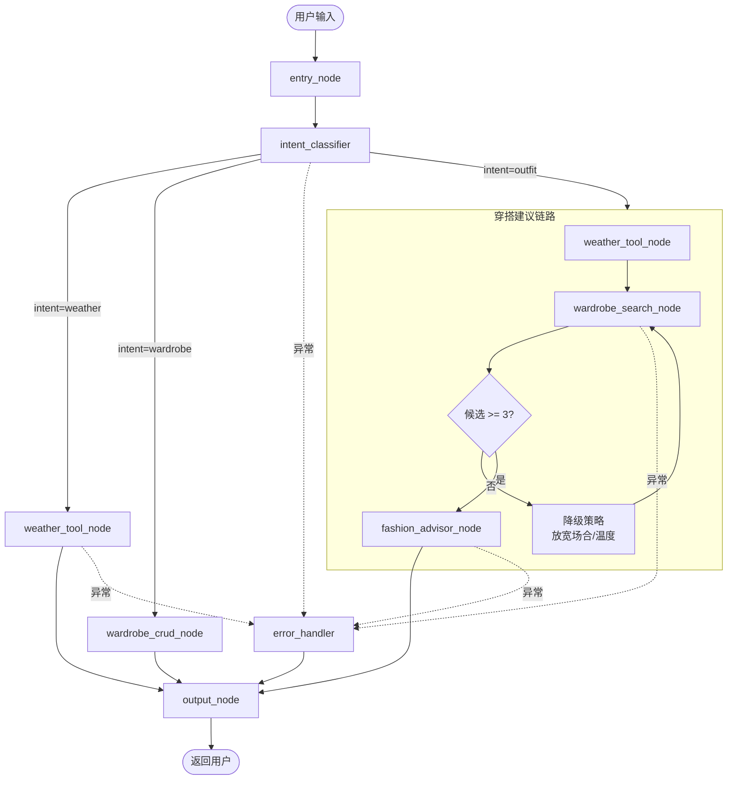

# 智能穿搭助手 - 架构蓝图（AI 实现参考）

## 1. 系统架构

本系统采用**主从式智能体架构**，以 LangGraph 作为编排框架，整体分为五个层次：

- **用户交互层**：命令行 CLI（MVP）/ Streamlit Web（增强版）
- **智能体编排层**：LangGraph StateGraph 状态机
- **智能体执行层**：主控 Agent（意图分类+路由）、时尚顾问 Agent（搭配生成）
- **工具服务层**：天气工具（和风天气 API）、衣橱工具（JSON + 规则过滤）
- **数据存储层**：本地 JSON 文件（衣橱数据）、内存缓存（天气数据，10分钟）

核心设计原则：Agent 负责推理决策，Tool 负责外部调用，状态对象贯穿全链路。

---

## 2. 代码目录结构

```markdown
smart-wardrobe/
├── main.py                  # CLI 入口
├── src/
│   ├── web_app.py           # Streamlit 入口（增强版）
│   ├── config.py            # 环境变量与配置
│   ├── agents/
│   │   ├── main_controller.py   # 主控 Agent：LangGraph StateGraph 定义 + 节点函数
│   │   └── fashion_advisor.py   # 时尚顾问 Agent：搭配生成 Prompt + 调用
│   ├── tools/
│   │   ├── weather.py           # 天气工具：和风天气 API + 城市代码转换 + 缓存
│   │   └── wardrobe.py          # 衣橱工具：JSON 读写 + 规则过滤检索
│   ├── models/
│   │   └── schemas.py           # Pydantic / TypedDict 模型定义
│   ├── storage/
│   │   ├── wardrobe.json        # 衣橱数据（运行时自动创建）
│   │   └── preferences.json     # 偏好数据（增强版预留）
│   ├── utils/
│   │   ├── cache.py             # 天气缓存（TTL 10分钟）
│   │   └── logger.py            # 步骤耗时记录
│   └── .env                     # 环境变量（API Keys）
└── requirements.txt
```
## 3. LangGraph 状态定义

使用 `TypedDict` 定义全局状态对象，所有节点通过该对象共享数据。

```python
from typing import TypedDict, Optional, List, Dict, Any

class AgentState(TypedDict):
    user_input: str                    # 用户原始输入
    intent: Optional[str]              # 意图：outfit / weather / wardrobe / preference
    weather_data: Optional[Dict]       # 结构化天气数据
    occasion: Optional[str]           # 场合：casual / work / interview / date / sports / formal
    wardrobe_candidates: List[Dict]     # 候选衣物列表
    preferences: Optional[Dict]       # 用户偏好（增强版预留）
    final_output: Optional[str]        # 系统最终回复
    chat_history: List[Dict]            # 多轮对话历史，格式 [{"role": "user", "content": "..."}, ...]
    error_info: Optional[str]          # 异常信息
    session_id: str                    # 会话唯一标识
    timestamp: str                     # 请求时间戳
```

---

## 4. 工具接口签名

所有工具通过 `@tool` 装饰器注册，供 LangGraph 节点直接调用。

```python
from langchain_core.tools import tool
from typing import List, Dict, Optional

# 工具一：获取天气
@tool
def get_weather(city: str) -> Dict:
    """
    获取指定城市实时天气，返回结构化数据。
    内部处理：城市名称 -> 城市代码转换 -> 和风天气 API -> 缓存 -> 解读标签
    """
    pass

# 工具二：检索衣橱
@tool
def search_wardrobe(
    temp: int,
    condition: str,
    occasion: str = "casual",
    limit: int = 8
) -> List[Dict]:
    """
    基于规则过滤检索衣橱：温度范围匹配 + 场合标签匹配 + 偏好排除。
    返回候选衣物列表，每个元素包含 id, name, category, color, material, 
    suitable_temp_min, suitable_temp_max, occasion_tags。
    """
    pass

# 工具三~六：衣橱 CRUD
@tool
def add_clothing(name: str, category: str, color: str, material: str,
                 suitable_temp_min: int = 0, suitable_temp_max: int = 40,
                 occasion_tags: Optional[List[str]] = None) -> Dict:
    """添加衣物，返回 {success, id, error}"""

@tool
def delete_clothing(clothing_id: str) -> Dict:
    """删除衣物，返回 {success, error}"""

@tool
def list_wardrobe() -> List[Dict]:
    """返回所有衣物列表"""

@tool
def update_clothing(clothing_id: str, **kwargs) -> Dict:
    """更新衣物信息，返回 {success, error}"""
```

---

## 5. LangGraph 状态机节点与边

### 5.1 节点定义

| 节点名                 | 职责                        | 读写状态                                   |
| ---------------------- | --------------------------- | ------------------------------------------ |
| `entry_node`           | 接收输入，初始化状态        | 写 `user_input`, `session_id`, `timestamp` |
| `intent_classifier`    | LLM 意图分类 + 场合提取     | 写 `intent`, `occasion`                    |
| `weather_tool_node`    | 调用天气工具                | 写 `weather_data`                          |
| `wardrobe_search_node` | 调用衣橱检索                | 写 `wardrobe_candidates`                   |
| `wardrobe_crud_node`   | 执行衣橱增删改查            | 写 `final_output`（操作结果）              |
| `fashion_advisor_node` | 调用时尚顾问 Agent 生成建议 | 写 `final_output`                          |
| `output_node`          | 组装回复，更新对话历史      | 写 `chat_history`                          |
| `error_handler`        | 捕获异常，返回友好提示      | 写 `error_info`, `final_output`            |

### 5.2 状态图结构（Mermaid）



### 5.3 条件路由逻辑

```python
def route_by_intent(state: AgentState) -> str:
    intent = state.get("intent")
    if intent == "weather":
        return "weather_tool_node"
    elif intent == "wardrobe":
        return "wardrobe_crud_node"
    elif intent == "outfit":
        return "weather_tool_node"  # 穿搭链路先走天气
    else:
        return "error_handler"
```

---

## 6. 外部 API 配置

### 6.1 和风天气 API

- **接口**：开发版 / 免费版 REST API
- **认证**：API Key 通过 `HEWEATHER_KEY` 环境变量注入
- **城市转换**：内置映射表（主要城市）+ GeoAPI 兜底
- **缓存**：`utils/cache.py` 实现 TTL 缓存（10 分钟），Key 为城市名

### 6.2 DeepSeek API

- **接口**：OpenAI 兼容格式 `https://api.deepseek.com/v1/chat/completions`
- **认证**：`DEEPSEEK_API_KEY` 环境变量
- **模型**：`deepseek-chat`（DeepSeek-V3）
- **温度**：意图分类 0.3（稳定），搭配生成 0.5（合理多样性）
- **Token 记录**：每次调用记录 input/output tokens 到日志

---

## 7. 数据流示例（面试穿搭）

以用户输入 **"今天下午有个面试，帮我看看穿什么"** 为例：

1. **entry_node**：`user_input` = "今天下午有个面试...", `session_id` = uuid, `timestamp` = now
2. **intent_classifier**：LLM 识别 `intent` = "outfit", `occasion` = "interview"
3. **weather_tool_node**：`get_weather("武汉")` → `weather_data` = {temp: 25, condition: "晴", tips: "舒适温度，注意防晒"}
4. **wardrobe_search_node**：`search_wardrobe(temp=25, occasion="interview")` → `wardrobe_candidates` = [白衬衫, 深蓝西裤, 黑皮鞋]
5. **fashion_advisor_node**：LLM 综合天气+候选+场合 → `final_output` = "今天25°C晴天，建议白衬衫+深蓝西裤+黑皮鞋..."
6. **output_node**：将 `final_output` 追加到 `chat_history`，返回用户

---

## 8. 可扩展接口设计

### 8.1 存储层抽象

```python
from abc import ABC, abstractmethod

class BaseWardrobeStorage(ABC):
    @abstractmethod
    def add(self, clothing: Dict) -> str: pass  # 返回 id
    
    @abstractmethod
    def delete(self, clothing_id: str) -> bool: pass
    
    @abstractmethod
    def update(self, clothing_id: str, data: Dict) -> bool: pass
    
    @abstractmethod
    def list_all(self) -> List[Dict]: pass
    
    @abstractmethod
    def search(self, filters: Dict) -> List[Dict]: pass
```

**当前实现**：`JSONStorage`（文件读写）
**未来扩展**：`SQLiteStorage`, `PostgreSQLStorage`

### 8.2 检索层抽象

```python
class BaseWardrobeRetriever(ABC):
    @abstractmethod
    def retrieve(self, temp: int, occasion: str, preferences: Dict) -> List[Dict]: pass
```

**当前实现**：`RuleFilterRetriever`（温度范围 + 场合标签 + 偏好排除）
**未来扩展**：`VectorRetriever`（Chroma / 语义检索）

### 8.3 工具注册机制

```python
# tools/registry.py
TOOL_REGISTRY = {}

def register_tool(func):
    TOOL_REGISTRY[func.__name__] = func
    return func

# 使用装饰器自动注册
@register_tool
def get_weather(city: str): ...
```

新增工具只需加 `@register_tool`，主控 Agent 通过注册表发现工具，无需修改路由代码。

---

## 9. AI IDE 实现指令

基于以上蓝图，请生成完整的可运行项目：

1. **先实现 `models/schemas.py`**：定义 `AgentState` TypedDict 和 `Clothing` Pydantic 模型
2. **再实现 `tools/weather.py` 和 `tools/wardrobe.py`**：确保工具函数可独立测试
3. **然后实现 `agents/main_controller.py`**：构建 LangGraph StateGraph，包含所有节点和条件边
4. **接着实现 `agents/fashion_advisor.py`**：定义搭配生成的 System Prompt，接收 state 返回建议
5. **最后实现 `main.py`**：CLI 循环，读取用户输入 → 调用 graph.invoke() → 打印回复
6. **预留 `app.py`**：Streamlit 界面（增强版）

**约束**：
- 所有 API Key 从 `.env` 读取，代码中不得出现硬编码密钥
- 衣橱 JSON 文件不存在时自动初始化空列表
- 意图分类 LLM 调用必须返回可解析的 JSON（如 `{"intent": "outfit", "occasion": "interview"}`）
- 时尚顾问 Agent 的 Prompt 必须约束：只能从 `wardrobe_candidates` 中选择衣物，禁止编造

